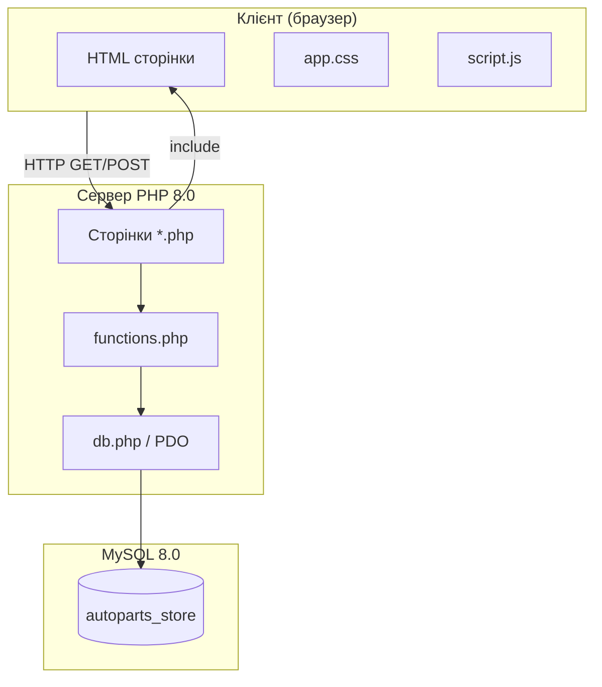
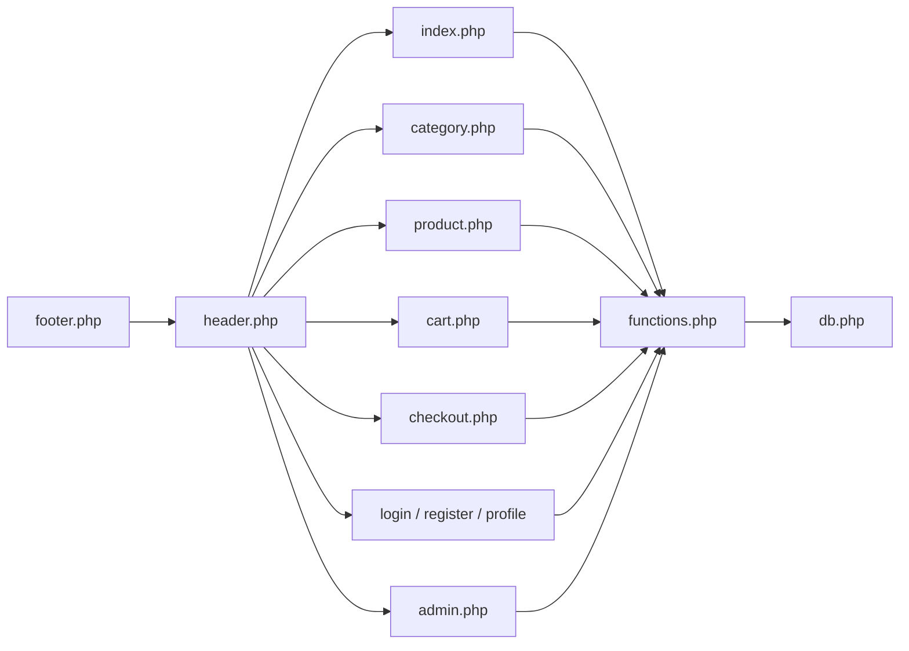
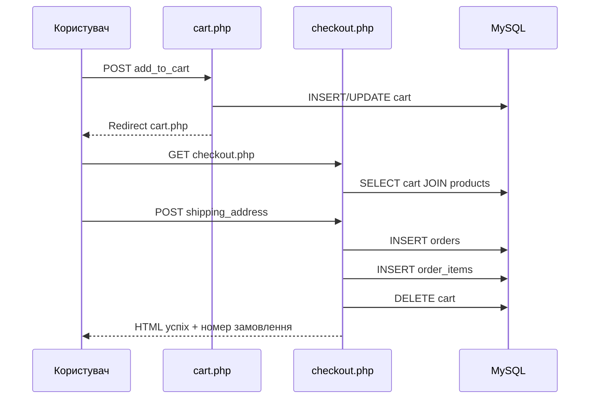

# Архітектура та проєктування системи

## 2.1 Архітектурний стиль

Застосовано **двошарову архітектуру «тонкий клієнт — серверний рендеринг»**:



**Відсутній** окремий шар Application Services або Domain Model (OOP). Логіка розподілена між файлами сторінок і функціями в `functions.php`.

## 2.2 Діаграма модулів



## 2.3 Життєвий цикл HTTP-запиту

1. Apache отримує запит на `*.php`.
2. `functions.php` підключає `db.php`, викликає `session_start()`.
3. Сторінка виконує перевірки (`isLoggedIn`, `isAdmin`) за потреби.
4. Обробка `$_GET` / `$_POST` (мутації БД, редіректи `header('Location: ...')`).
5. `include 'header.php'` — початок HTML.
6. Розмітка сторінки з PHP-циклами `foreach`.
7. `include 'footer.php'` — підвал, `<script src="script.js">`.

## 2.4 Управління сесією та авторизація

| Змінна сесії | Джерело | Використання |
|--------------|---------|--------------|
| `$_SESSION['user_id']` | `login.php` після успішного входу | FK у `cart`, `orders` |
| `$_SESSION['role']` | поле `users.role` | `isAdmin()` для `admin.php` |

```php
// functions.php — фактична реалізація
function isLoggedIn() {
    return isset($_SESSION['user_id']);
}
function isAdmin() {
    return isset($_SESSION['role']) && $_SESSION['role'] === 'admin';
}
```

Вихід: `logout.php` викликає `session_destroy()`.

## 2.5 Потік оформлення замовлення



**Статус замовлення** при створенні: значення за замовчуванням з БД — `'Нове'`. Поле `shipping_address` зберігається; `phone` і `notes` з форми — **ні**.

## 2.6 Потік адміністрування товару

| Дія | HTTP | Параметри POST |
|-----|------|----------------|
| Додати | POST `admin.php` | `add_product`, name, short_description, description, price, image, stock, category_id |
| Оновити | POST `admin.php?edit_product={id}` | `update_product`, product_id, ... |
| Видалити | GET `admin.php?action=delete_product&id={id}` | — |

## 2.7 Ініціалізація бази даних

Файл `db.php` виконує `ensure_autoparts_schema($pdo)` при **кожному** підключенні:

- `CREATE TABLE IF NOT EXISTS` для всіх таблиць;
- seed користувачів, категорій, товарів, якщо таблиці порожні;
- seed кошика та замовлень за умови наявності демо-користувачів.

Альтернатива — одноразовий імпорт `autoparts_shop.sql`.

## 2.8 Клієнтський шар

| Файл | Підключення | Призначення |
|------|-------------|-------------|
| `app.css` | `header.php` | Повний UI магазину |
| `script.js` | `footer.php` | UX: меню, кошик, анімації |
| `style.css`, `ui.css` | — | Не використовуються в поточній збірці |

## 2.9 Точки розширення (рекомендації, не в коді)

Для еволюції архітектури без зміни поточної документації «як є»:

1. Винести SQL у репозиторії або мінімальні класи `ProductRepository`, `CartService`.
2. Підключити `searchProducts()` на `index.php` при `isset($_GET['q'])`.
3. Додати `password_hash()` / `password_verify()`.
4. Окремий `api/v1/*.php` з JSON для Postman/Swagger як справжній REST.
