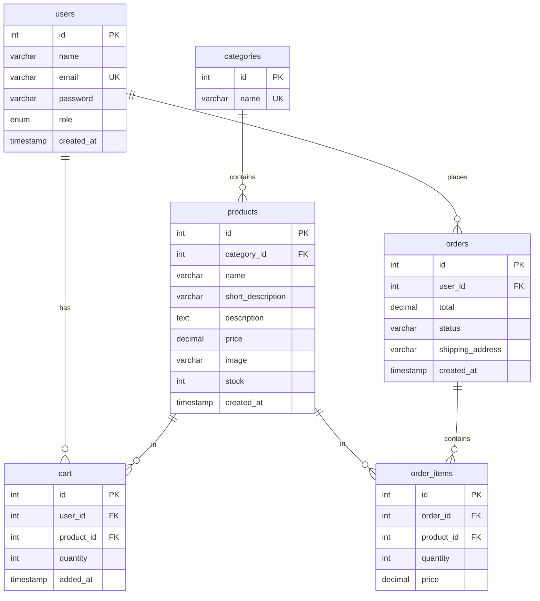

# Документація бази даних `autoparts_store`

## 3.1 Загальні відомості

| Параметр | Значення |
|----------|----------|
| СУБД | MySQL 8.0 |
| Ім’я БД | `autoparts_store` |
| Кодування | `utf8mb4` |
| Движок таблиць | InnoDB |
| Підключення (код) | `host=MySQL-8.0`, `user=root`, `pass=''` |

Джерела схеми: `db.php` (runtime), `autoparts_shop.sql` (дамп).

## 3.2 ER-діаграма (логічна)



## 3.3 Опис таблиць

### `users`

| Поле | Тип | Обмеження | Опис |
|------|-----|-----------|------|
| id | INT | PK, AI | Ідентифікатор |
| name | VARCHAR(100) | NOT NULL | Ім’я |
| email | VARCHAR(150) | NOT NULL, UNIQUE | Логін |
| password | VARCHAR(255) | NOT NULL | Пароль (**plaintext у демо**) |
| role | ENUM('admin','user') | DEFAULT 'user' | Роль |
| created_at | TIMESTAMP | DEFAULT CURRENT_TIMESTAMP | Дата реєстрації |

### `categories`

| Поле | Тип | Опис |
|------|-----|------|
| id | INT PK | ID категорії |
| name | VARCHAR(100) UNIQUE | Назва українською |

### `products`

| Поле | Тип | Опис |
|------|-----|------|
| id | INT PK | ID товару |
| category_id | INT FK → categories | Категорія |
| name | VARCHAR(150) | Назва |
| short_description | VARCHAR(255) | Короткий опис у картці |
| description | TEXT | Повний опис |
| price | DECIMAL(10,2) | Ціна, UAH |
| image | VARCHAR(255) | Ім’я файлу в `images/` |
| stock | INT | Залишок |
| created_at | TIMESTAMP | Для сортування «нові надходження» |

### `cart`

| Поле | Тип | Опис |
|------|-----|------|
| id | INT PK | ID рядка кошика |
| user_id | INT FK → users | Власник |
| product_id | INT FK → products | Товар |
| quantity | INT DEFAULT 1 | Кількість |
| added_at | TIMESTAMP | Час додавання |

**Унікальність:** `UNIQUE (user_id, product_id)` — один рядок на пару; повторне додавання збільшує `quantity`.

### `orders`

| Поле | Тип | Опис |
|------|-----|------|
| id | INT PK | Номер замовлення |
| user_id | INT FK | Покупець |
| total | DECIMAL(10,2) | Сума на момент оформлення |
| status | VARCHAR(50) | Нове / В обробці / … |
| shipping_address | VARCHAR(255) | Адреса доставки |
| created_at | TIMESTAMP | Дата створення |

### `order_items`

| Поле | Тип | Опис |
|------|-----|------|
| id | INT PK | — |
| order_id | INT FK | Замовлення |
| product_id | INT FK | Товар |
| quantity | INT | Кількість |
| price | DECIMAL(10,2) | **Ціна на момент покупки** (snapshot) |

## 3.4 Статуси замовлення (адмін-панель)

| Значення | Де задається |
|----------|--------------|
| Нове | DEFAULT у БД; опція select |
| В обробці | admin.php |
| Відправлено | admin.php |
| Виконано | admin.php |
| Скасовано | admin.php |

## 3.5 Демо-дані після seed

### Кошик

| user_id | product_id | quantity |
|---------|------------|----------|
| 2 | 1 | 1 |
| 2 | 6 | 2 |
| 3 | 3 | 1 |
| 3 | 12 | 1 |

### Замовлення

| id | user | total | status | address |
|----|------|-------|--------|---------|
| 1 | client | 6020.00 | Нове | м. Київ, вул. Хрещатик, 10 |
| 2 | maria | 890.00 | В обробці | м. Львів, вул. Січових Стрільців, 5 |

## 3.6 Приклади SQL-запитів з коду

**Останні 8 товарів на головній (`index.php`):**

```sql
SELECT * FROM products ORDER BY created_at DESC LIMIT 8
```

**Кошик користувача (`cart.php`):**

```sql
SELECT c.id as cart_id, p.*, c.quantity
FROM cart c
JOIN products p ON c.product_id = p.id
WHERE c.user_id = ?
```

**Додавання в кошик:**

```sql
INSERT INTO cart (user_id, product_id, quantity) VALUES (?, ?, ?)
ON DUPLICATE KEY UPDATE quantity = quantity + ?
```

## 3.7 Утиліта `delete_users.php`

Службовий скрипт для видалення користувачів `client@gmail.com` та `maria@gmail.com` разом із `cart`, `order_items`, `orders` у транзакції. Не є частиною публічного UI.

## 3.8 Зображення товарів

Очікуваний каталог: `images/{image}` з БД, наприклад `ap_engine_01.jpg`. Відсутність файлу призведе до зламаного `` у браузері — перевірити наявність при розгортанні.
